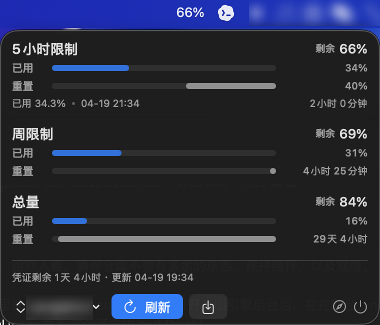

# 火山Code订阅用量

一个只做一件事的 macOS 菜单栏应用：  
直接在 menubar 查看火山引擎 TokenPlan / CodingPlan 的用量。

## 功能

- menubar 直接显示 5 小时限制的剩余百分比
- 点击后查看三档配额：
  - 5 小时限制
  - 周限制
  - 总量
- 支持手动刷新
- 支持重新导入 cURL
- 支持删除已导入账号数据
- 仅使用本地私有文件保存导入信息，不走 Keychain 弹窗

## 使用方式

### 1. 下载 Release

直接从 GitHub Release 下载最新 `.dmg`：

- [lewarh/volcengine-tokenplan-menubar Releases](https://github.com/lewarh/volcengine-tokenplan-menubar/releases)

### 2. 导入火山引擎请求 cURL

1. 打开火山引擎控制台：
   - `https://console.volcengine.com/ark/region:ark+cn-beijing/openManagement?advancedActiveKey=subscribe`
2. 打开浏览器开发者工具
3. 在 `Network` 中搜索：
   - `GetCodingPlanUsage`
4. 找到该请求后，复制它的：
   - `Copy as cURL (bash)`
5. 回到应用，进入导入界面，直接粘贴即可

## 预览截图



## Development

- 产品 / 交互 / 实现取向参考：`VIBE_REFERENCE.md`

## 本项目的本地开发（给 LLM Agent 看）

- 人类不需要看这一节；直接在仓库目录下告诉 Agent 要做什么即可
- 本项目是 Swift Package Manager 的 macOS menubar app
- 常用命令如下

### 本地运行

```bash
make run
```

### 构建

```bash
make build
```

### 打包 `.app` 和 `.dmg`

```bash
make dmg
```

生成产物：

- `dist/火山Code订阅用量.app`
- `dist/Volcengine-TokenPlan-Menubar.dmg`
